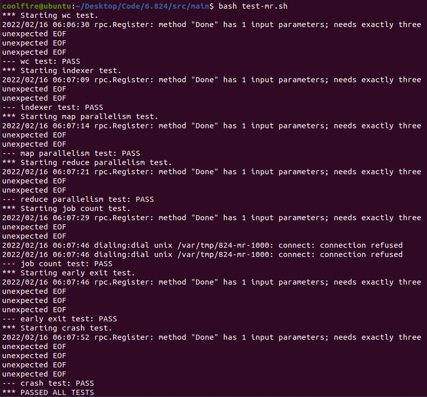

# MIT-6.824

## Lab1 MapReduce

[6.824 Lab 1: MapReduce (mit.edu)](https://pdos.csail.mit.edu/6.824/labs/lab-mr.html)

### 原理图


### 非分布式实现

src/main/mrsequential.go

```shell
cd src/main
go build -buildmode=plugin ../mrapps/wc.go
go run mrsequential.go wc.so pg*.txt
```

wc.so为动态库 pg*.txt为电子书

Go RPC sends only struct fields whose names start with capital letters. Sub-structures must also have capitalized field names.

### 分布式实现

```shell
go build -race -buildmode=plugin ../mrapps/wc.go
rm mr-out*
go run -race mrcoordinator.go pg-*.txt
go run -race mrworker.go wc.so

bash test-mr.sh
```

以下信息可忽略

```shell
rpc.Register: method "Done" has 1 input parameters; needs exactly three
```

os.Exit(1)告知操作系统有错误退出

### 运行结果

整体上通过了测试

- 存在的EOF错误未知

- dial unix connect错误应该是由于Coordinator退出而存在worker没有退出，导致call没有返回结果



### 参考链接

[GitHub - yzongyue/6.824-golabs-2020: MIT 6.824 2020](https://github.com/yzongyue/6.824-golabs-2020)
